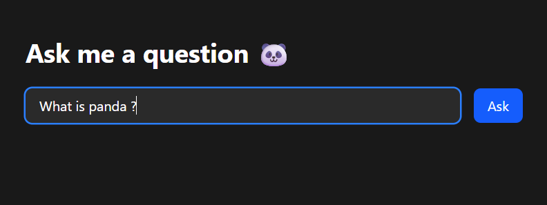
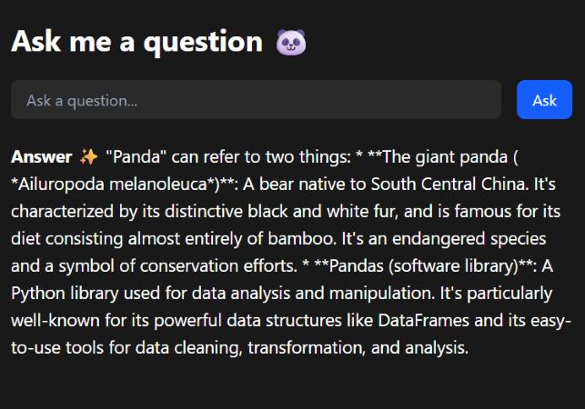

# 🔮 Q&A Web App

A simple full-stack web app built with **React** and **FastAPI** that lets users ask natural language questions and get real-time answers using **Google's Gemini 1.5 Flash** model.


##  Features

-  Ask natural questions in a text field
-  Get answers instantly from Gemini LLM (Google Generative Language API)
-  Fullstack: React frontend + FastAPI backend
-  CORS-enabled, environment variable-based API key handling
-  Easily extensible to add Q&A history, to-do list, or feedback tracking


## 🧱 Tech Stack

| Layer     | Tech         |
|-----------|--------------|
| Frontend  | React (Vite) |
| Backend   | FastAPI      |
| LLM API   | Google Gemini 1.5 Flash |
| Hosting   | Local or cloud-ready (Render, Railway, etc.) |


## ⚙️ Setup Instructions


###  1. Clone the repository

```bash
git https://github.com/rtiwari13/feedback_flow.git
cd gemini-qa-app
```

### 2. Set up the Gemini API Key
📄 Create a .env file in backend/:
```bash
GEMINI_API_KEY=your_actual_google_api_key_here
```
- Make sure .env is in .gitignore

### 3. Backend Setup (FastAPI)

```bash
cd fbf_backend
```
```bash
python -m venv venv
source venv/bin/activate  # Windows: venv\Scripts\activate
```
```bash
pip install -r requirements.txt
uvicorn main:app --reload
```
FastAPI will run at:`http://localhost:8000`

### frontend
```bash
cd frontend
npm install
npm run start 
```
React app will run at: `http://localhost:3000` 

## Usage :
- Type any natural question in the input box

- Click Ask

- The answer from Gemini appears below the input

- Repeat for multiple questions!


##  Screenshots



